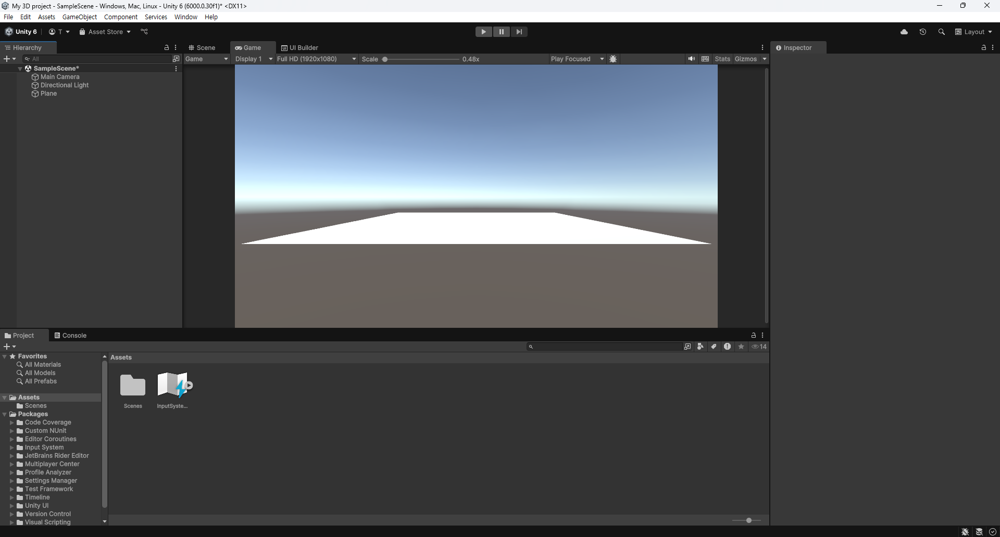
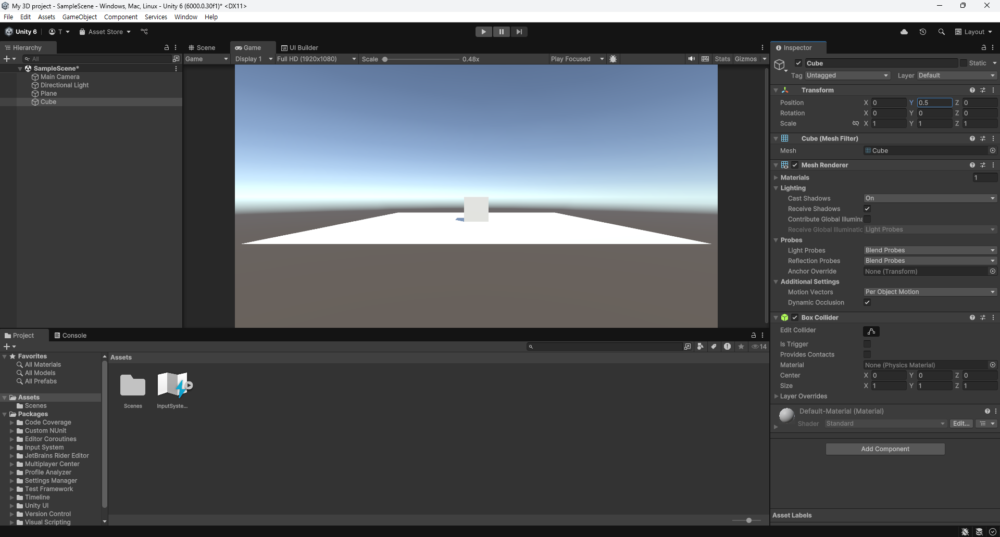

# 02. Unity 시작하기

## 1. 프로젝트 생성
1. `Unity Hub` 열기
2. `Projects` → `New Project` 클릭
3. `All templates` → `3D (Built-In Render Pipeline)` 선택
4. `Project name`, `Location` 설정 후 `Create project` 클릭 

## 2. 오브젝트 만들기
1. `Hierarchy` 창에서 빈화면에 마우스 우클릭을 하여 오브젝트 생성 가능
2. `3D Object` → `Plane` 생성

3. `3D Object` → `Cube` 생성

4. `Inspector` 창에서 `Position` → `Y`를 0.5로 변경


## 3. 오브젝트 움직이기
1. `Assets` 창에서 마우스 우클릭
2. `Create` → `MonoBehaviour Script` 클릭
3. `NewMonoBehaviourScript` 열기
4. 아래의 코드 작성
```CSharp
using UnityEngine;

public class NewMonoBehaviourScript : MonoBehaviour
{
    public float speed = 5.0f; // Speed of the object

    void Update()   // Update is called once per frame
    {
        if (Input.GetKey(KeyCode.LeftArrow)) // If the left arrow key is pressed
        {
            transform.position += Vector3.left * speed * Time.deltaTime;    // Move the object to the left
        }
        if (Input.GetKey(KeyCode.RightArrow))   // If the right arrow key is pressed
        {
            transform.position += Vector3.right * speed * Time.deltaTime;   // Move the object to the right
        }
    }
}
```
5. `Hierarchy` 창에서 Cube 선택 후 `Assets` 창에서 `NewMonoBehaviourScript`파일을 `Inspector` 창에 끌어옴
6. `Play` 버튼(▶)을 눌러 실행 
7. 키보드의 좌우 화살표(←,→)를 눌러 제대로 실행되는지 확인
